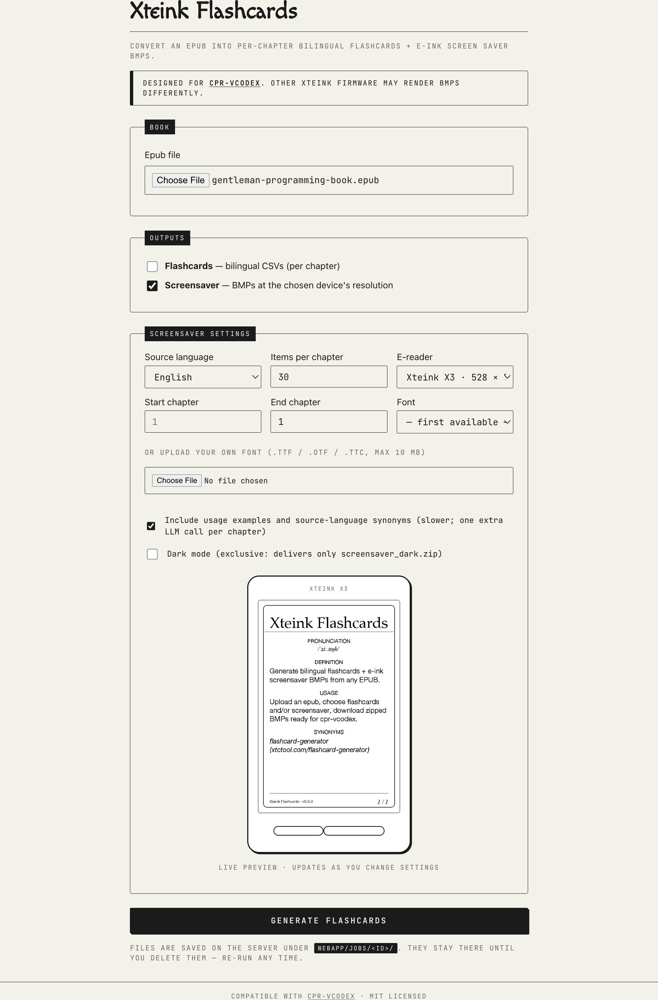
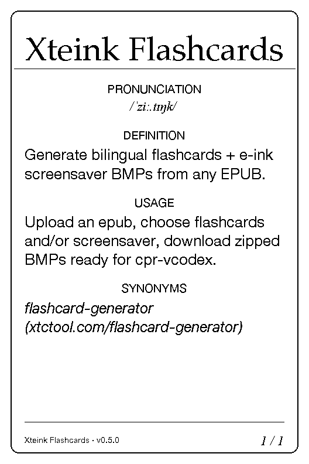
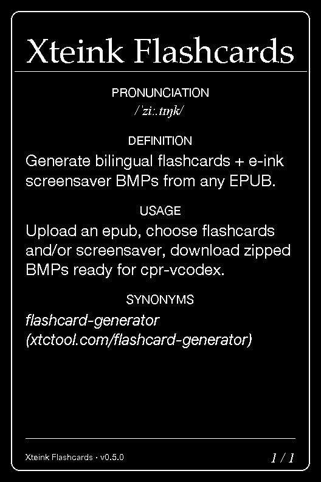

# Xteink Flashcards

**Turn any epub into per-chapter flashcards and e-ink screensaver BMPs for [Xteink X3](https://www.xteink.com/) *and* X4 readers.**

A self-hosted pipeline (Flask + [Ollama](https://ollama.com) + [StarDict](https://en.wikipedia.org/wiki/StarDict)) that runs entirely on your own machine — no cloud, no API keys, no data leaves your network.

## Supported devices

| Model | Resolution | Aspect |
|---|---|---|
| **Xteink X3** | 528 × 792 | 2:3 |
| **Xteink X4** | 480 × 800 | 3:5 |

Pick your model in the upload form. The renderer scales fonts and spacing proportionally so the dictionary-entry layout fits either screen. (You can also pass `--width` / `--height` to the CLI to override.)

## What it produces

Upload an epub. Pick your languages. Get back **one or both** of:

| Output | Format | What it is |
|---|---|---|
| `flashcards.zip` | per-chapter CSV (`English,Spanish`) | Bilingual flashcards ready to drop on the Xteink's `/flashcards/` folder. |
| `screensaver.zip` | per-chapter BMP (device resolution, 1-bit) | Lock-screen images with IPA pronunciation, definition, usage, synonyms — dictionary-entry style. Optionally a second `screensaver_dark.zip` for OLED or night-mode devices. |

Each archive is regenerated from scratch on every run, so you can iterate freely while reading.

## Screenshots

### Web upload form

The form splits outputs into two sections (Flashcards and Screensaver)
with independent source language, chapter range, items and font. The
screensaver settings include a live preview inside a CSS-only Xteink
device frame that updates as you change the dropdowns and reuses the
same `render_card` pipeline as real jobs.



### Output cards

Screensaver BMPs are rendered at the device's native resolution with a
dictionary-entry layout: word + underline at the top, pronunciation,
definition, optional usage example and source-language synonyms.

Light variant:



Dark variant — the exclusive toggle delivers only this archive and
no light ZIP:



## Why it exists

Off-the-shelf e-readers don't have a great vocabulary-acquisition workflow. The Xteink X3 supports dictionary lookup and a sleep-image screensaver, but neither learns your book. This tool bridges that gap by:

1. Asking a local LLM to extract **C1–C2 vocabulary** from each chapter.
2. Falling back to **StarDict** for definitions, IPA pronunciation and synonyms (no LLM hallucinated definitions).
3. Laying everything out on the e-ink screen as if it were a personalised dictionary.

It's the system the author uses to work through Spanish/English technical books on their own Xteink.

## Architecture

```
┌──────────────────────────────────────────────────────────┐
│  Browser (http://macmini.local:5000)                    │
└──────────────────┬───────────────────────────────────────┘
                   │ multipart upload
┌──────────────────▼───────────────────────────────────────┐
│  Docker container (Flask + gunicorn)                     │
│  - webapp/app.py                                         │
│  - imports scripts/epub_to_flashcards.py                │
│  - imports scripts/enrich_flashcards.py                  │
│  - imports scripts/generate_flashcard_bmps.py            │
└──────┬─────────────────────────────┬─────────────────────┘
       │ localhost:11434             │ /wikdict-en-es
       ▼                             ▼
┌──────────────────┐      ┌──────────────────────────────┐
│  Ollama (host)   │      │  StarDict files (.ifo/.idx    │
│  llama3.1:8b     │      │  /.dict/.syn) baked into     │
└──────────────────┘      │  image via COPY              │
                         └──────────────────────────────┘
```

---

## Prerequisites

- Docker (Desktop or OrbStack)
- Ollama installed and running on the host (`ollama serve`)
- A pulled Ollama model: `ollama pull llama3.1:8b`
- The two StarDict dictionaries in this directory:
  - `wikdict-en-es/` (English → Spanish)
  - `wikdict-es-en/` (Spanish → English)

---

## Run locally (development, no Docker)

```bash
# 1. install python deps
pip install -r requirements.txt

# 2. start
cd webapp
python app.py

# browse http://localhost:5000
```

The app reads Ollama from `localhost:11434` by default. Override with:

```bash
OLLAMA_HOST=http://localhost:11434 OLLAMA_MODEL=llama3.1 python app.py
```

---

## Run via Docker (recommended for the Mac mini)

```bash
# build image (StarDict files are COPYed into it)
docker compose build

# start the service in the background, exposed on host port 5000
docker compose up -d

# follow logs
docker compose logs -f webapp

# stop
docker compose down
```

Then browse to:

```
http://<macmini-name-or-ip>:5000
```

### Two outputs, your choice

The form lets you enable one, both, or neither of:

- **Flashcards** — bilingual CSVs per chapter. Source / target / items / chapter
  range are independent from the screensaver settings.
- **Screensaver** — BMPs at the device's native resolution, rendered through the
  same `render_card` pipeline shown in the live preview. Source language, items,
  chapter range, font, dark mode and `with-examples` are independent from the
  flashcards settings. When dark mode is on, the job produces **only**
  `screensaver_dark.zip` (the light pass is suppressed).

Each output runs in the same job and reuses the chapter-detection step, but
its settings are independent. The dark mode toggle is **exclusive** — toggling
it on guarantees that no light ZIP is created, even if the user has both
outputs enabled.

---

## Project layout

```
.
├── scripts/                    # helper scripts (also importable as modules)
│   ├── epub_to_flashcards.py   # bilingual extraction pipeline
│   ├── enrich_flashcards.py    # StarDict + Ollama enrichment
│   └── generate_flashcard_bmps.py  # 528×792 BMP renderer
├── webapp/
│   ├── app.py                  # Flask app
│   ├── templates/              # base.html, index.html, job.html
│   ├── static/style.css        # a few CSS tweaks on top of PicoCSS
│   ├── jobs/                   # runtime: per-job output + meta.json (gitignored)
│   └── uploads/                # runtime: original epubs (gitignored)
├── wikdict-en-es/              # StarDict dictionary (English → Spanish)
├── wikdict-es-en/              # StarDict dictionary (Spanish → English)
├── Dockerfile
├── docker-compose.yml
├── .dockerignore
├── requirements.txt
├── .gitignore
├── README.md
└── AGENTS.md                   # workspace notes
```

---

## How long does a job take?

Roughly 30–90 seconds per chapter for the bilingual CSVs (one Ollama call per
chapter). For BMP generation, +30 seconds per chapter if you tick "include
examples". A 24-chapter book with both outputs and examples ≈ 30 minutes.

The web UI polls `/job/<id>/status.json` every 2.5 seconds and shows current
phase + per-chapter progress.

---

## Notes

- One job at a time. If you upload while another is running, the second upload
  gets a 409 with the active job id — wait for it (or kill the container).
- All processing runs inside the container; nothing is uploaded to the cloud.
- The StarDict files are small (~5 MB each) so we COPY them into the image
  instead of mounting — no need for bind mounts that drift out of sync.

## Persisting uploaded fonts

Uploaded fonts land in `webapp/fonts/` inside the container. That
directory is created at startup and lives on the container's writable
layer, so any font you upload is visible in the screensaver dropdown
for as long as the container is running — days, weeks, whatever.

As soon as the container is destroyed (`docker compose down`, a
`docker compose up -d --build` that recreates the service, or a host
reboot), that writable layer is gone and the uploaded fonts vanish.

To survive restarts and rebuilds, mount a Docker volume on top of
`webapp/fonts/` in your `docker-compose.yml`:

```yaml
services:
  webapp:
    # ... existing service config ...
    volumes:
      - webapp_fonts:/app/webapp/fonts

volumes:
  webapp_fonts:
```

With that mount in place, a `docker compose down && docker compose up -d`
keeps every font you uploaded across restarts. Use a named volume
(`webapp_fonts:`) for portability across hosts, or a bind mount
(`./fonts-data:/app/webapp/fonts`) if you want the files visible on
the host filesystem for backup.

## Data & licensing

- The bundled **StarDict** dictionaries (`wikdict-en-es/`, `wikdict-es-en/`) come from
  [wikdict.com](http://www.wikdict.com/) (FreeDict + Wiktionary via DBnary) and are
  licensed under **CC BY-SA 4.0**. Attribution is preserved in each `.ifo` file.
- The **Python code** (scripts, webapp, Docker setup, docs) is released under the
  [MIT License](./LICENSE).

## Compatibility

This tool is designed for and tested against [**cpr-vcodex**](https://github.com/franssjz/cpr-vcodex),
the open firmware that ships the `/flashcards/` and screensaver features on Xteink
X3 and X4 readers. Other Xteink firmwares may render the BMPs differently — for
example, the screensaver may ignore the file naming convention or expect a
different BMP header. If you are running stock firmware, check the
[cpr-vcodex README](https://github.com/franssjz/cpr-vcodex) before generating
cards so you know what to expect on-device.

## License

[MIT](./LICENSE) — do whatever you like, attribution appreciated.

